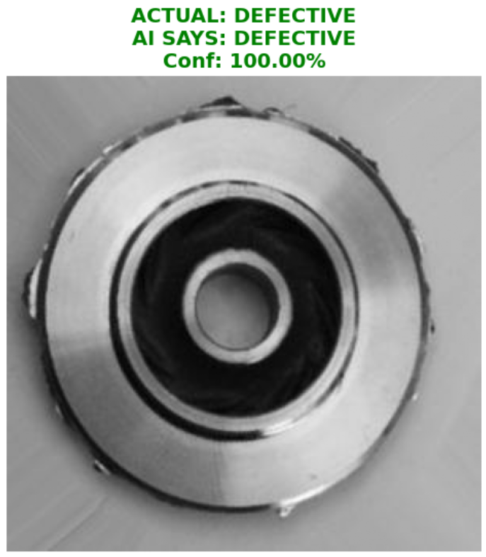
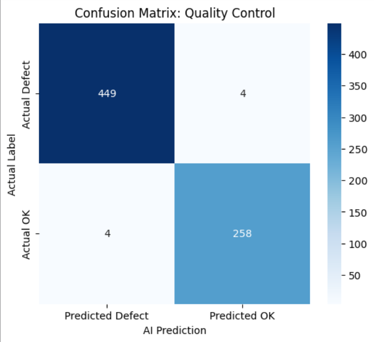

# Automated Quality Control: Casting Defect Detection using CNNs

## 📌 Project Overview

In high-volume manufacturing, specifically in the casting industry, manual inspection of products for defects (like blowholes, pinholes, and cracks) is labor-intensive, prone to human fatigue, and creates bottlenecks.

This project implements a **Deep Learning Computer Vision** solution to automate the visual inspection process. Using a Convolutional Neural Network (CNN), the system analyzes top-view images of submersible pump impellers to classify them as **"Defective"** or **"OK"** with high precision.

## 🏭 Domain Context (Industry 4.0)

  * **The Problem:** Casting defects compromise the structural integrity of mechanical components. A "False Negative" (telling a customer a broken part is good) is extremely costly in the automotive and aerospace sectors.
  * **The Solution:** An Automated Optical Inspection (AOI) system that runs 24/7, maintains consistent standards, and catches "fine detail" defects that human eyes might miss after a long shift.

## 📂 The Dataset

  * **Source:** [Kaggle: Real Life Industrial Dataset of Casting Product](https://www.kaggle.com/datasets/ravirajsinh45/real-life-industrial-dataset-of-casting-product)
  * **Subject:** Submersible Pump Impellers (casting product).
  * **Format:** Grayscale images (300x300 pixels).
  * **Classes:**
      * `def_front` (Defective): Contains physical anomalies.
      * `ok_front` (Good): structurally sound.

## 🛠️ Tech Stack

  * **Language:** Python 3.x
  * **Deep Learning Framework:** TensorFlow / Keras
  * **Data Processing:** NumPy, Pandas
  * **Visualization:** Matplotlib, Seaborn
  * **Metrics:** Scikit-Learn (Confusion Matrix, Classification Report)

## 🧠 Model Architecture

I designed a custom **Convolutional Neural Network (CNN)** specifically tailored for texture and edge detection on metallic surfaces:

1.  **Input Layer:** 300x300x1 (Grayscale)
2.  **Feature Extraction:**
      * 4 blocks of `Conv2D` + `BatchNormalization` + `MaxPooling2D`.
      * Filter count increases (32 -\> 64 -\> 64 -\> 128) to capture progressively complex features:
          * *Shallow layers:* Detect edges and circular outlines (impeller shape).
          * *Deep layers:* Detect surface textures, roughness, and tiny blowholes.
3.  **Regularization:** `Dropout(0.2)` is used to prevent overfitting on the training data.
4.  **Output Layer:** `Sigmoid` activation function for binary classification (Probability 0.0 to 1.0).

## 📊 Performance Metrics

The model was optimized for **Recall** rather than just Accuracy.

  * *Why Recall?* In manufacturing, it is better to flag a good part as bad (False Positive) than to ship a bad part to a customer (False Negative).
  * **Loss Function:** Binary Crossentropy.
  * **Optimizer:** Adam.

*(You can add your specific results here, e.g.:)*

> **Results:**
>
>   * **Recall:** \~98% (High sensitivity to defects)
>   * **Accuracy:** \~95%+

## 📈 Visuals

### Sample Predictions

### Confusion Matrix

  * **Top Left (True Negative):** Correctly identified defective parts.
  * **Bottom Right (True Positive):** Correctly identified healthy parts.

## 🔮 Future Improvements

  * **Data Augmentation:** Implement random rotation and lighting changes to simulate different factory lighting conditions.
  * **Deployment:** Wrap the model in a **FastAPI** backend to serve predictions to a manufacturing dashboard.
  * **Edge Deployment:** Optimize the model (quantization) to run on edge devices like a Raspberry Pi or NVIDIA Jetson for real-time line inference.
